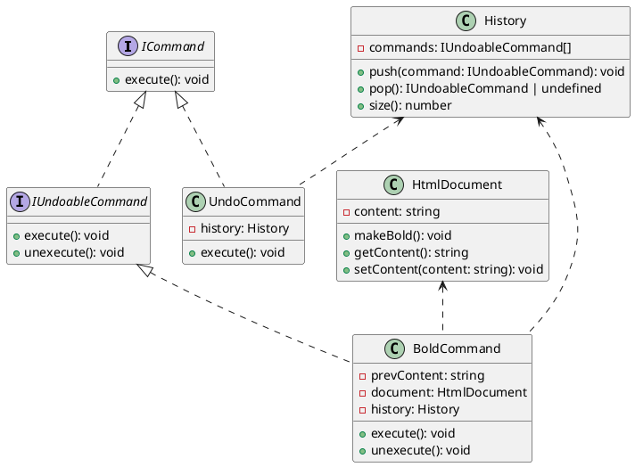

---

# Undoable Command Design Pattern Example

This project demonstrates the implementation of the Undoable Command Design Pattern in TypeScript. The Undoable Command Pattern allows you to execute commands and then undo them, providing a way to implement undo/redo functionality.

## Components of the Undoable Command Pattern

1. **Command Interface**: Defines the interface for executing an operation. In this example, `ICommand` is the Command interface.
2. **Undoable Command Interface**: Extends the Command interface to include an unexecute method. In this example, `IUndoableCommand` is the Undoable Command interface.
3. **Concrete Commands**: Implement the Command and Undoable Command interfaces to perform specific actions. In this example, `BoldCommand` is the Concrete Command.
4. **Receiver**: Knows how to perform the operations associated with a request. In this example, `HtmlDocument` is the Receiver.
5. **Invoker**: Keeps track of commands and can execute or unexecute them. In this example, `History` and `UndoCommand` are the Invokers.

## Class Diagram

Below is a class diagram for the Undoable Command Pattern implementation:


## Classes and Implementation

### ICommand (Command Interface)

This interface defines the method required for executing a command.

```typescript
interface ICommand {
  execute(): void;
}
```

### IUndoableCommand (Undoable Command Interface)

This interface extends `ICommand` to include an unexecute method for undoing the command.

```typescript
interface IUndoableCommand extends ICommand {
  unexecute(): void;
}
```

### HtmlDocument (Receiver)

This class represents a simple HTML document that can have its content modified.

```typescript
class HtmlDocument {
  private content: string = "";

  public makeBold() {
    this.content = "<b>" + this.content + "</b>";
  }

  public getContent(): string {
    return this.content;
  }

  public setContent(content: string): void {
    this.content = content;
  }
}
```

### History (Invoker)

This class keeps track of executed commands to enable undo functionality.

```typescript
class History {
  constructor(private commands: IUndoableCommand[] = []) {}

  public push(command: IUndoableCommand) {
    this.commands.push(command);
  }

  public pop(): IUndoableCommand | undefined {
    return this.commands.pop();
  }

  public size(): number {
    return this.commands.length;
  }
}
```

### BoldCommand (Concrete Command)

This class implements the `IUndoableCommand` interface to make the document content bold and allow undoing the action.

```typescript
class BoldCommand implements IUndoableCommand {
  private prevContent: string = "";

  constructor(private document: HtmlDocument, private history: History) {}

  execute(): void {
    this.prevContent = this.document.getContent();
    this.document.makeBold();
    this.history.push(this);
  }

  unexecute(): void {
    this.document.setContent(this.prevContent);
  }
}
```

### UndoCommand (Invoker)

This class implements the `ICommand` interface to undo the last executed command.

```typescript
class UndoCommand implements ICommand {
  constructor(private history: History) {}

  execute(): void {
    if (this.history.size()) {
      this.history.pop()!.unexecute();
    }
  }
}
```

## Class Diagram



## Usage Example

Below is an example of how to use the implemented classes to execute and undo commands.

```typescript
const document = new HtmlDocument();
document.setContent("Hello World");

const history = new History();
const boldCommand = new BoldCommand(document, history);
const undoCommand = new UndoCommand(history);

boldCommand.execute();
console.log(document.getContent()); // Output: <b>Hello World</b>

undoCommand.execute();
console.log(document.getContent()); // Output: Hello World
```

## Conclusion

The Undoable Command Pattern is useful for executing commands and then undoing them, providing a way to implement undo/redo functionality. This example demonstrates how the pattern can be applied to modify a document's content and undo the changes.

---
