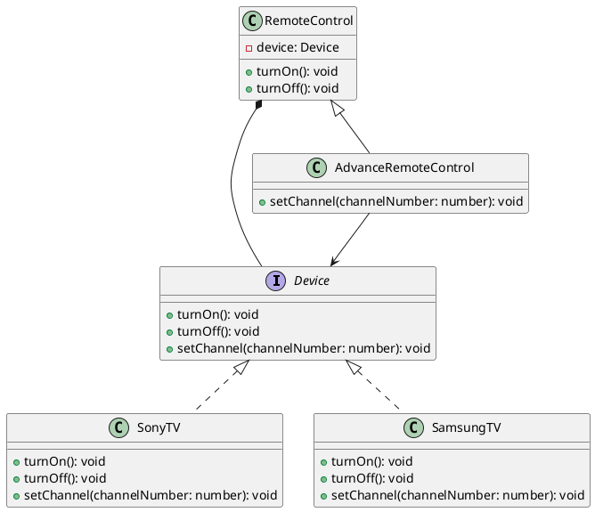

### Bridge Pattern

The Bridge Pattern is a structural design pattern that decouples an abstraction from its implementation so that the two can vary independently. It is used when you want to avoid a permanent binding between an abstraction and its implementation, allowing both to be modified independently.

## Class Diagram

Below is a class diagram for the Bridge Pattern implementation:


### Code Explanation

The provided code demonstrates the Bridge Pattern using a remote control and different types of TVs (Sony and Samsung).

1. **Device Interface**: Defines the operations that can be performed on a device.
2. **SonyTV and SamsungTV Classes**: Implement the `Device` interface and provide concrete implementations for turning on/off and setting the channel.
3. **RemoteControl Class**: Acts as an abstraction and holds a reference to a `Device` object. It provides methods to turn the device on and off.
4. **AdvanceRemoteControl Class**: Extends `RemoteControl` to add more functionality, such as setting the channel.

### UML Diagram



### Code

```typescript
interface Device {
  turnOn(): void;
  turnOff(): void;
  setChannel(channelNumber: number): void;
}

class RemoteControl {
  constructor(protected device: Device) {}

  public turnOn(): void {
    this.device.turnOn();
  }

  public turnOff(): void {
    this.device.turnOff();
  }
}

class AdvanceRemoteControl extends RemoteControl {
  constructor(device: Device) {
    super(device);
  }

  public setChannel(channelNumber: number): void {
    this.device.setChannel(channelNumber);
  }
}

class SonyTV implements Device {
  setChannel(channelNumber: number): void {
    console.log("Sony: setChannel");
  }

  turnOff(): void {
    console.log("Sony: turnOff");
  }

  turnOn(): void {
    console.log("Sony: turnOn");
  }
}

class SamsungTV implements Device {
  turnOn(): void {
    console.log("Samsung: turnOn");
  }

  turnOff(): void {
    console.log("Samsung: turnOff");
  }

  setChannel(channelNumber: number): void {
    console.log("Samsung: setChannel");
  }
}
```

### Usage Example

```typescript
const sonyTv = new SonyTV();
const remoteControl = new RemoteControl(sonyTv);

remoteControl.turnOn();
remoteControl.turnOff();

const samsungTv = new SamsungTV();
const advanceRemote = new AdvanceRemoteControl(samsungTv);

advanceRemote.turnOn();
advanceRemote.setChannel(5);
advanceRemote.turnOff();
```

In this example, `RemoteControl` and `AdvanceRemoteControl` are abstractions that work with any device that implements the `Device` interface. This allows `RemoteControl` and its subclasses to be decoupled from the specific implementations of `Device`, enabling flexibility and independent extensibility of both abstraction and implementation.