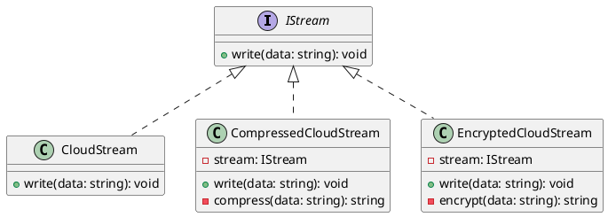

---

# Decorator Design Pattern Example

This project demonstrates the implementation of the Decorator Design Pattern in TypeScript. The Decorator Pattern allows behavior to be added to individual objects dynamically, without affecting the behavior of other objects from the same class.

## Components of the Decorator Pattern

1. **Component Interface**: Defines the interface for objects that can have responsibilities added to them dynamically. In this example, the `IStream` interface represents the component interface.
2. **Concrete Component**: Represents the base class to which additional functionality can be added. In this example, the `CloudStream` class acts as the concrete component.
3. **Decorator**: A wrapper class that implements the component interface and adds additional behavior to the component object. In this example, `CompressedCloudStream` and `EncryptedCloudStream` act as decorators.

## Class Diagram

Below is a class diagram for the Decorator Pattern implementation:


## Classes and Implementation

### IStream (Component Interface)

This interface defines the method for writing data.

```typescript
interface IStream {
    write(data: string): void;
}
```

### CloudStream (Concrete Component)

This class implements the `IStream` interface and represents the base component.

```typescript
class CloudStream implements IStream {
    public write(data: string) {
        console.log("Storing ", data);
    }
}
```

### CompressedCloudStream (Decorator)

This class wraps an `IStream` object and adds compression functionality.

```typescript
class CompressedCloudStream implements IStream {
    constructor(private stream: IStream) {}

    public write(data: string): void {
        const compressed = this.compress(data);
        console.log(compressed, '---------------')
        this.stream.write(compressed);
    }

    private compress(data: string): string {
        return data.slice(0, 4);
    }
}
```

### EncryptedCloudStream (Decorator)

This class wraps an `IStream` object and adds encryption functionality.

```typescript
class EncryptedCloudStream implements IStream {
    constructor(private stream: IStream) {}

    public write(data: string): void {
        const encrypted = this.encrypt(data);
        this.stream.write(encrypted);
    }

    private encrypt(data: string): string {
        return "!@$#@%#^$%&%^";
    }
}
```

## Usage Example

Below is an example of how to use the implemented classes to store data with various decorations.

```typescript
const cloudStream = new CloudStream();
const compressedStream = new CompressedCloudStream(cloudStream);
const encryptedStream = new EncryptedCloudStream(cloudStream);

cloudStream.write("Data to store");
compressedStream.write("Data to store");
encryptedStream.write("Data to store");
```

## UML Class Diagram



## Conclusion

The Decorator Pattern allows behavior to be added to individual objects dynamically, providing an alternative to subclassing for extending functionality. This example demonstrates how decorators can be used to add compression and encryption functionality to a cloud storage system without modifying existing code.

---
